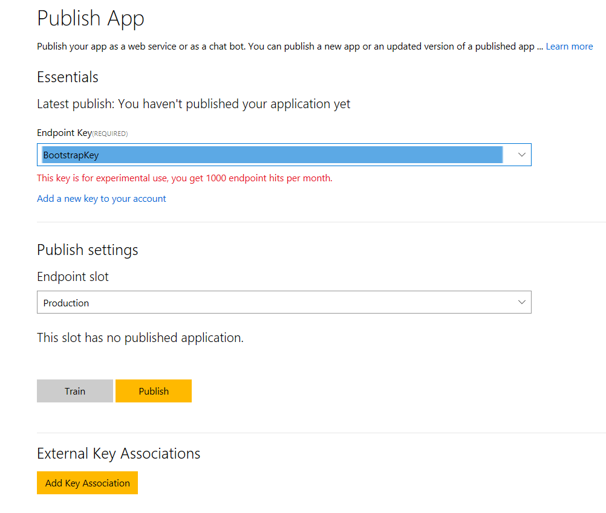
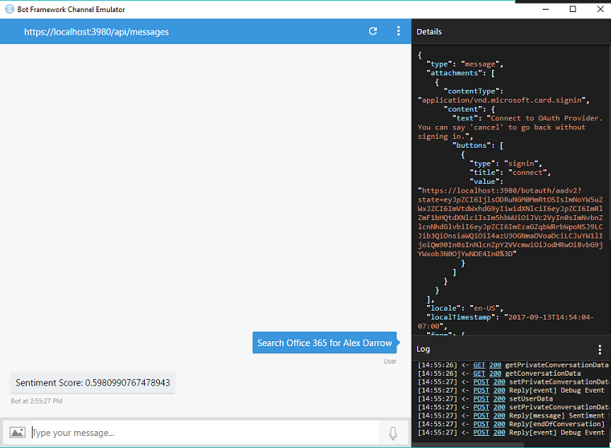

# Microsoft Graph Sentiment Analysis Bot

## Table of contents

* [Introduction](#introduction)
* [Prerequisites](#prerequisites)
* [Get a key for the Text Analytics API](#get-a-key-for-the-text-analytics-api) 
* [Publish the LUIS model](#publish-the-luis-model)
* [Register the web application](#register-the-web-application)
* [Build the sample](#build-and-run-the-sample)
* [Run the sample](#run-the-sample)
* [Questions and comments](#questions-and-comments)
* [Contributing](#contributing)
* [Additional resources](#additional-resources)

## Introduction

This sample shows how to build a [Microsoft Bot Framework](https://dev.botframework.com/) bot that connects to [Microsoft Graph](https://developer.microsoft.com/en-us/graph/), searches through email messages, and performs sentiment analysis on those messages by using the [Microsoft Text Analytics cognitive service](https://docs.microsoft.com/en-us/azure/cognitive-services/text-analytics/quick-start). It leverages the [Language Understanding Intelligent Service](https://www.luis.ai) to help your bot understand the queries you send to it.

## Prerequisites

To use the Microsoft Graph Connect Sample for Node.js, you need the following:

 * [Node.js](https://nodejs.org/)
 * The [Bot Framework Emulator](https://docs.microsoft.com/en-us/bot-framework/debug-bots-emulator)
 * Either a [Microsoft account](https://www.outlook.com/) or a [work or school account](http://dev.office.com/devprogram)
 * A [Microsoft Azure Account](https://azure.microsoft.com/en-us/free/)
 * A [Language Understanding Intelligent Service Account](https://www.luis.ai/)

In addition to these prerequisites, you'll need to [get a subscription key for the Text Analytics API](#get-a-key-for-the-text-analytics-api)), [publish a LUIS model](), and [register a web client application](#register-the-web-application). The following three sections describe how to get these additional resources.

## Get a key for the Text Analytics API

1. Sign in to the [Azure Portal](https://portal.azure.com]).

2. Choose **More services** at the bottom of the left column of the page.

3. In the **Filter** box at the top of the **More Services** column, type **Cognitive Services**.

4. Choose the **Cognitive Services** option when it appears.

5. Choose the **Add** button at the top of the page.

6. Choose the **Text Analytics API (preview)** option in the right pane.

7. Choose the **Create** button at the bottom of the right pane.

8. Type a name for your subscription and select a plan. You may select the free tier for 5,000 transactions per month.

9. Read and confirm that you've understood the notice near the bottom of the pane, and then select the **Create** button at the very bottom.

10. After you've created your subscription, navigate to your subscription and select **Keys** under the **Resource Management** section of the center pane.

11. Copy the value of the first key ("Key 1"). You'll use this value in the [Build the sample](#build-and-run-the-sample) section.


## Publish the LUIS model

1. Navigate to the [Language Understanding Intelligent Service](https://www.luis.ai) (LUIS) home page.

2. Create a LUIS account if you don't already have one. You'll automatically navigate to your account dashboard.

3. Choose **My apps** in the upper left corner of the dashboard page.

4. Choose **Import App**

5. In the popup, browse to the [SearchBotLUIS.json](./SearchBotLuis.json) file in the root directory of this repo.

6. Choose the **Import** button. You'll automatically navigate to the dashboard page of your new app.

7. Choose **Publish App** in the left menu.

8. Select the default **BootstrapKey** option as the value for **Endpoint key**, and then select the **Publish** button.


9. Copy the **Endpoint url** value. You'll use this value in the [Build the sample](#build-and-run-the-sample) section.

10. Select **Train and Test** in the left menu to go to a page where you can run test queries against your published model. Type **Search Office 365 for Graph** in the test utterance pane to verify that your new application is finding an intent for this query.

## Register the web application

1. Sign into the [App Registration Portal](https://apps.dev.microsoft.com/) using either your personal or work or school account.u

2. Choose **Add an app**.

3. Enter a name for the app, and choose **Create application**. 
	
   The registration page displays, listing the properties of your app.

4. Copy the Application Id. This is the unique identifier for your app. 

5. Under **Application Secrets**, choose **Generate New Password**. Copy the password from the **New password generated** dialog.

   You'll use the application ID and secret to configure the sample app in the next section. 

6. Under **Platforms**, choose **Add Platform**.

7. Choose **Web**.

8. Enter *https://localhost:3980/botauth/aadv2/callback* as the Redirect URI. 

9. Choose **Save**.

## Build the sample

1. Download or clone this repo.

2. Using your favorite IDE, open the **.env** file in the root directory of the repo.

3. Replace the **ENTER_YOUR_COG_SERVICE_SUBSCRIPTION_KEY** placeholder value with the Text Analytics API key that you copied in the [Get a key for the Text Analytics API](#get-a-key-for-the-text-analytics-api) section.

4. Replace the **ENTER_YOUR_LUIS_MODEL_URL** placeholder value with the endpoint url that you copied in the [Publish the LUIS model](#publish-the-luis-model) section.

5. Replace the **ENTER_YOUR_CLIENT_ID** and **ENTER_YOUR_CLIENT_SECRET** placeholder values with the application Id and application secret that you copied in the [Register the web application](#register-the-web-application) section.

6. In a command prompt, run the following command in the root directory. This installs the project dependencies.

  ```npm install```

7. Run the following command to start the development server.

  ```npm start```

8. Launch the [Bot Framework Emulator](https://docs.microsoft.com/en-us/bot-framework/debug-bots-emulator).

9. Choose the **Connect** button.

10. Enter the messaging endpoint for this bot project: https://localhost:3980/api/messages. Leave the Microsoft App ID and Microsoft App Password values blank. These are for published bots.

11. Choose the **Connect** button. 

## Run the sample

1. Type a query into the Bot Framework Emulator in this form: **Search Office 365 for Graph**.

2. You'll see a **Connect** button in the emulator. Choose this button to launch a web page that displays a string in the browser. You'll be prompted to type that string into your emulator chat. Note that your browser might warn you that your PC doesn't trust the site's security certificate. Choose the option to continue to the web page.

3. After you type the string into your chat, you'll get a message indicating the sentiment score for your query.


4. Type additional queries to see the cognitive service's sentimental analysis at work.

## Questions and comments

We'd love to get your feedback about the Microsoft Graph Connect Sample for Node.js. You can send your questions and suggestions in the [Issues](https://github.com/microsoftgraph/nodejs-sentiment-bot-sample/issues) section of this repository.

Questions about Microsoft Graph development in general should be posted to [Stack Overflow](https://stackoverflow.com/questions/tagged/microsoftgraph). Make sure that your questions or comments are tagged with [microsoftgraph].

## Contributing ##

If you'd like to contribute to this sample, see [CONTRIBUTING.MD](/CONTRIBUTING.md).

This project has adopted the [Microsoft Open Source Code of Conduct](https://opensource.microsoft.com/codeofconduct/). For more information see the [Code of Conduct FAQ](https://opensource.microsoft.com/codeofconduct/faq/) or contact [opencode@microsoft.com](mailto:opencode@microsoft.com) with any additional questions or comments.
  
## Additional resources

- [Other Microsoft Graph samples](https://github.com/microsoftgraph?utf8=%E2%9C%93&q=sample)
- [Microsoft Graph](https://graph.microsoft.io)

## Copyright
Copyright (c) 2017 Microsoft. All rights reserved.
